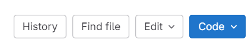
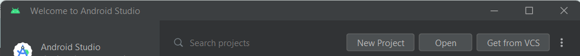
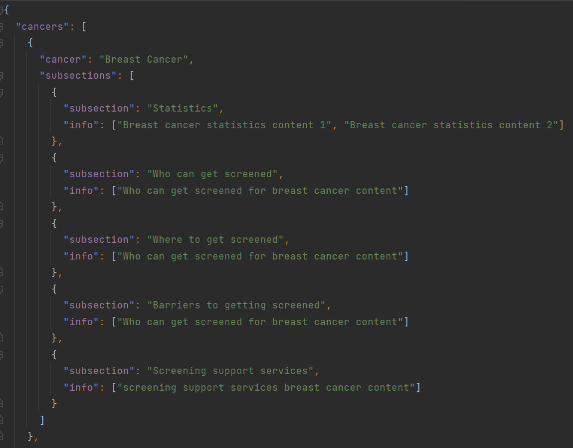

# Screening for Health - A Cancer Society App


Screening for Health is a tablet application by the Cancer Society. Its aim is to help people understand what screening is in order to encourage more people to get screened early. The app covers content for the three main screening programmes in New Zealand: Breast Cancer, Bowel Cancer and Cervical Cancer.


## Installation

### Setting up git and Android Studio with project

In order to change any code, you will need to download Android Studio and edit through there. This can be downloaded here: 

https://developer.android.com/studio


To download these code files to your local computer:

1. If you do not have it already, install git here: https://www.git-scm.com/download/win
2. Go to https://eng-git.canterbury.ac.nz/nse41/seng402-app
3. Click the blue code button, and copy the link under 'Clone with HTTPS' 
4. On your computer, open file explorer and navigate to the folder you wish to access the code from, then right click and click 'Open in terminal'
5. In terminal, type in git clone followed by the link you copied, and press enter
6. Open Android Studio, and click 'Open'

7. Navigate to the folder you just cloned to your computer and click Ok. The project will now open up and may take some time to prepare everything.

### Updating code or information in app

If you are looking to update the information displayed in the app, within Android Studio, navigate to app > assets > CancerInfo.json and open this file.

The structure of this file sorts each cancer into their own section, each with their own subsection as shown below. You can now change any information here.



### Saving any changes to the code

If you have edited any code or text in the JSON file, you will need to save these changes to git. 

1. Open the code folder in terminal, like in step 4 above. 
2. Type the following into terminal:
```
git add .
git commit -m "Updated x files with x changes" 
git push
```

This will push the changes to the repository. 


### Running the app on a physical device

If you are looking to run the app on a physical tablet/mobile device, there are two ways to do this. Either by connecting the device over WiFi, or connecting through USB. Once you have run the app on the device after connecting, it will be updated on the device and you will be able to use it without connection.

#### Connecting over WiFi

Follow these steps to connect to the device over WiFi.

https://developer.android.com/tools/adb#connect-to-a-device-over-wi-fi

#### Connecting over USB

Follow these steps to connect to the device over a USB connection.

https://developer.android.com/studio/run/device#connect


## Code Structure

The code has been written using Kotlin, and is structured in 4 different directories/folders: Navigation, Screens, UI.Theme, and Utilities. Most code files will have a Javadoc at the top to describe the purpose of it. 

### Navigation

This folder holds all code files related to how the navigation in the app works (i.e. going from screen to screen)

## Screens

This is the main folder with all the code for each screen of the app.

## UI.Theme

This holds the colours and themes used for the app styling

## Utilities

This has code related to reading the JSON files for quiz questions and information, and also code on making different elements of the page responsive to screen size


## Authors and acknowledgement

This app was developed for the Cancer Society.

Email nirhjah.selvarajah@gmail.com with any questions

## License

Images from svgrepo.com have been used for this application, and the following describes the licenses used for the images:
- MIT License, see LICENSE.md
- CC Attribution License for use of images from the 'Soco St Various Illustration Vectors' Collection: https://www.svgrepo.com/collection/soco-st-various-illustration-vectors/

